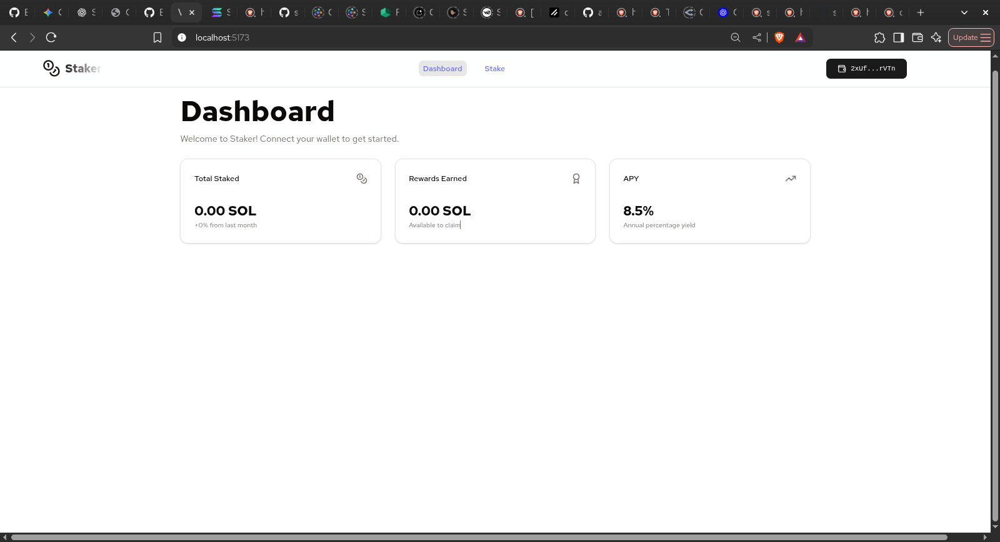
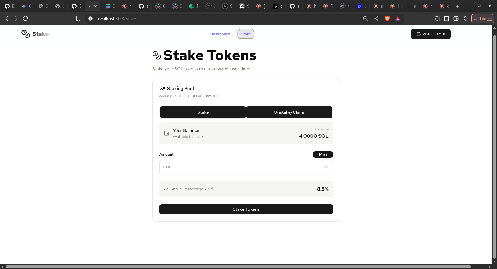

# 🎯 Solana SPL Stake Pool & Token Management Suite

This project provides a comprehensive solution for managing and interacting with a Solana SPL Stake Pool. It includes a full-featured Anchor program that serves as an interface to the official SPL Stake Pool program, and a modern, user-friendly React frontend for seamless user interaction.

## ✨ Features

- **Liquid Staking:** Deposit SOL or stake accounts to receive pool tokens.
- **Validator Management:** Add/remove validators, rebalance stake, and set preferred validators.
- **Dynamic Fees:** Configure and manage pool fees.
- **Token Metadata:** Create and update on-chain token metadata for the pool token.
- **User-Friendly Frontend:** A responsive and intuitive React-based UI for all staking operations.

## 🏗️ Architecture

The project follows a modern, decentralized application (dApp) architecture:

- **Frontend:** A React application built with Vite, TypeScript, and Tailwind CSS. It uses the Solana Wallet Adapter for secure, non-custodial wallet interactions.
- **Backend:** The on-chain logic is handled by an Anchor program that interfaces with the SPL Stake Pool program on the Solana blockchain.
- **Deployment:** The frontend is designed for deployment on JAMstack hosting platforms like Vercel, while the on-chain program is deployed to the Solana network.

For a detailed overview of the architecture, please refer to the [Fullstack Architecture Document](./docs/architecture.md).

## 🚀 Getting Started

### Prerequisites

- [Node.js](https://nodejs.org/en/)
- [npm](https://www.npmjs.com/)
- [Rust & Cargo](https://www.rust-lang.org/tools/install)
- [Solana Tool Suite](https://docs.solana.com/cli/install-solana-cli-tools)
- [Anchor CLI](https://www.anchor-lang.com/docs/installation)

### Installation

1.  **Clone the repository:**
    ```bash
    git clone <repository-url>
    cd staker
    ```

2.  **Install dependencies:**
    ```bash
    npm install
    ```

3.  **Airdrop SOL for development (if on a local or devnet):**
    ```bash
    solana airdrop 2
    ```

### Running the Application

-   **Start the frontend development server:**
    ```bash
    npm run dev:ui
    ```
-   **Deploy the on-chain program:**
    ```bash
    npm run deploy:program
    ```
-   **Run on-chain program tests:**
    ```bash
    npm run test:program
    ```

## 📚 Documentation

-   **[Product Requirements Document (PRD)](./docs/prd.md):** Detailed information about the project's goals, features, and user stories.
-   **[Fullstack Architecture Document](./docs/architecture.md):** A comprehensive guide to the technical architecture of the project.

## 🖼️ Screenshots

Here are some screenshots of the application in action:




## 📝 License

This project is licensed under the MIT License.