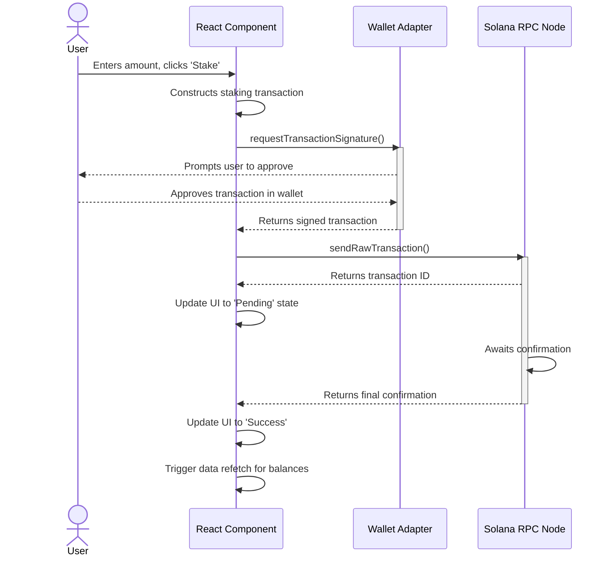

# Solana SPL Token Management Suite Fullstack Architecture Document

## Section 1: Introduction
This document outlines the complete fullstack architecture for the Solana SPL Token Management Suite, including the frontend implementation and its integration with the existing on-chain smart contracts. It serves as the single source of truth for AI-driven development, ensuring consistency across the entire technology stack.

### Starter Template or Existing Project
The project foundation is a codebase generated by an AI UI tool (e.g., v0). The analysis confirms the following:
* **Framework:** React with Vite
* **Language:** TypeScript
* **Styling:** Tailwind CSS
* **Component Library:** shadcn/ui
* **Blockchain Integration:** Pre-configured with stubs for the Solana Wallet Adapter.

This architecture will formalize and build upon this generated foundation, ensuring it is scalable, maintainable, and secure.

### Change Log
| Date | Version | Description | Author |
| :--- | :--- | :--- | :--- |
| 2025-07-27 | 1.0 | Initial architecture draft based on generated code analysis | Winston (Architect) |

## Section 2: High Level Architecture

### Technical Summary
The system will be a decentralized application (dApp) composed of a client-side React frontend and existing on-chain Solana smart contracts. The frontend will be deployed globally on a JAMstack hosting platform like Vercel for optimal performance and scalability. Users will interact with the application through their web browser, connecting their self-custody wallets (e.g., Phantom, Solflare) to sign and send transactions directly to the Solana network. The project's code will be managed in a Monorepo to facilitate code sharing and streamlined development.

### Platform and Infrastructure Choice
* **Platform:**
    * **Frontend Hosting:** **Vercel** is recommended for its seamless integration with modern React frameworks (like Vite), automatic CI/CD, global CDN, and serverless functions for any future needs.
    * **Backend & State:** The **Solana Blockchain** will serve as our backend. All application state and business logic are managed by the on-chain smart contracts.
* **Key Services:**
    * **Solana RPC Node:** To read on-chain data and submit transactions.
    * **Solana Wallet Adapter:** To securely connect with users' wallets.

### Repository Structure
* **Structure:** **Monorepo**.
* **Monorepo Tool:** We will use `npm workspaces` to manage the packages.
* **Package Organization:** The monorepo will contain the `staker-frontend` app and the `programs` directory at the root level.

### High Level Architecture Diagram
```mermaid
graph TD
    subgraph User's Browser
        A[React Frontend on Vercel] --> B[Solana Wallet Adapter];
        B --> C[User's Wallet (Phantom/Solflare)];
    end

    subgraph Solana Network
        D[RPC Node];
        E[SPL Stake Pool Programs];
    end

    C -- Signs Transaction --> A;
    A -- Submits Signed Transaction --> D;
    A -- Reads On-chain Data --> D;
    D -- Interacts with --> E;
```

### Architectural Patterns

  * **JAMstack Architecture:** The frontend will be a static/server-rendered site hosted on a global CDN, with dynamic functionality handled by client-side JavaScript interacting with the Solana network. *Rationale: This provides excellent performance, high security, and lower cost.*
  * **Component-Based UI:** We will use React's component model to build a reusable and maintainable user interface, leveraging `shadcn/ui`. *Rationale: This is standard for modern web development and aligns with the chosen tech stack.*
  * **Non-Custodial Wallet Interaction:** The application will never have access to user private keys. All transactions are created client-side and signed by the user's own wallet extension. *Rationale: This is the fundamental security model for dApps and ensures user funds are always in their control.*

## Section 3: Tech Stack

### Technology Stack Table

| Category | Technology | Version | Purpose | Rationale |
| :--- | :--- | :--- | :--- | :--- |
| **Frontend Language** | TypeScript | `~5.4.5` | Adds static typing to JavaScript for robustness. | Industry standard for React development; prevents common errors. |
| **Frontend Framework**| React | `~18.3.1` | The core UI library for building components. | User-specified and a leading choice for dApp development. |
| **UI Component Library**| shadcn/ui | `~0.8.0` | Provides unstyled, accessible components. | User-specified; offers full control over styling. |
| **State Management** | Zustand | `~4.5.2` | Lightweight global state management. | Simpler than Redux for this app's scope, minimal boilerplate. |
| **Backend Language** | Rust | `~1.79.0` | Language for the on-chain programs. | Existing backend technology; high performance and safety. |
| **Backend Framework** | Anchor | `~0.30.1` | Solana smart contract development framework. | Existing backend framework; simplifies Solana development. |
| **API Style** | JSON-RPC | `N/A` | Protocol for interacting with Solana nodes. | Standard method for all blockchain communication. |
| **Database** | Solana Blockchain | `N/A` | The decentralized ledger for all state. | Core of the dApp; provides a single source of truth. |
| **Authentication** | Solana Wallet Adapter| `~1.2.1` | Securely connects the dApp to user wallets. | Standard, secure way to handle authentication in Solana dApps. |
| **Frontend Testing** | Vitest + RTL | `~1.6.0` | Unit/Integration testing framework. | Native to Vite for fast performance; React Testing Library (RTL) is standard. |
| **E2E Testing** | Playwright | `~1.45.0` | End-to-end testing of user flows. | Modern, powerful, and reliable for testing browser interactions. |
| **Build Tool/Bundler**| Vite | `~5.3.1` | The development server and build tool. | Identified in generated code; known for excellent performance. |
| **CI/CD** | Vercel CI | `N/A` | Built-in continuous integration and deployment. | Comes with the recommended Vercel hosting platform. |
| **Monitoring** | Vercel Analytics | `N/A` | User and performance analytics. | Comes with the recommended Vercel hosting platform. |
| **CSS Framework** | Tailwind CSS | `~3.4.4` | Utility-first CSS framework for styling. | User-specified; excellent for rapid, custom UI development. |
| **Package Manager** | npm | `~10.8.1` | Package manager and monorepo orchestrator. | User-specified preference. |

## Section 4: Data Models

### Token

  * **Purpose:** Represents an SPL token, including its metadata. This is a foundational model needed for the staking feature.
  * **TypeScript Interface:**

<!-- end list -->

```typescript
export interface Token {
  address: string; // The token's mint address
  symbol: string;
  name: string;
  decimals: number;
  logoURI?: string; // Optional URL for the token's image
}
```

### UserStakedPosition

  * **Purpose:** Represents a user's complete position in the stake pool, containing all the necessary information to be displayed on the staking page.
  * **TypeScript Interface:**

<!-- end list -->

```typescript
export interface UserStakedPosition {
  stakedPoolTokens: number; // The amount of pool tokens the user holds
  stakedInSol: number;      // The SOL equivalent value of their staked tokens
  claimableRewards: number; // The amount of rewards earned in pool tokens
  rewardsInSol: number;     // The SOL equivalent value of their rewards
}
```

## Section 5: API Specification (On-Chain Program Interface)

### Staking Instructions

The frontend will primarily interact with the following instructions from the Anchor program:

  * `deposit_sol`: To deposit SOL into the pool in exchange for pool tokens (staking).
  * `withdraw_sol`: To burn pool tokens in exchange for SOL (unstaking).
  * `update_stake_pool_balance`: To refresh pool accounting data.
  * [cite\_start]The frontend will also need to read data directly from the `StakePool` and `ValidatorList` accounts to display UI state. [cite: 82-83]

### Architectural Finding: Missing Swap Functionality

The provided `staker.tar` source code is an SPL Stake Pool program. It does not contain the on-chain program for the Token Swap functionality. As per your decision, the MVP has been de-scoped to focus exclusively on the Staking feature.

## Section 6: Components

### Component List

  * **`WalletProvider` (Wrapper)**
      * **Responsibility:** Manages the global state of the wallet connection using the Solana Wallet Adapter.
  * **`WalletButton`**
      * **Responsibility:** The main UI element for connecting and disconnecting a wallet.
  * **`BalanceDisplay`**
      * **Responsibility:** A reusable component that fetches and displays the user's balance for a given SPL token.
  * **`StakingModule`**
      * **Responsibility:** The primary component for all staking-related actions (staking, unstaking, claiming rewards).
  * **`NotificationProvider` (Wrapper)**
      * **Responsibility:** A global provider for displaying toast notifications (e.g., "Transaction successful").

## Section 7: External APIs

For the MVP, there are no integrations with traditional third-party APIs. The application's only external communication is with the Solana RPC endpoint to interact with the blockchain.

## Section 8: Core Workflows

### Staking Transaction Flow



## Section 9: Database Schema

The application does not use a traditional database. The Solana Blockchain serves as the decentralized database. The "schema" is defined by the Rust structs within the on-chain Anchor program.

## Section 10: Frontend Architecture

### Component Architecture

  * **Component Organization:** We will adopt a feature-based folder structure inside `src/`.
    ```plaintext
    staker-frontend/
    └── src/
        ├── components/
        │   ├── ui/         # Generic shadcn components (Button, Card, etc.)
        │   └── layout/     # Header, Footer, MainLayout, etc.
        └── features/
            ├── wallet/     # WalletButton, BalanceDisplay, etc.
            └── staking/    # StakingModule, StakingForm, etc.
    ```
  * **Component Template:**
    ```typescript
    import { FC } from 'react';

    interface MyComponentProps {
      title: string;
    }

    export const MyComponent: FC<MyComponentProps> = ({ title }) => { /* ... */ };
    ```

### State Management Architecture

  * **Global State:** We will use **Zustand** for shared application state like wallet connection status and user balances.
  * **Local State:** Standard React hooks (`useState`) will be used for UI-only state (e.g., form inputs).

### Routing Architecture

  * **Library:** We will use `react-router-dom` for client-side routing.
  * **Routes:** `/` (Dashboard/Staking Page), `/*` (404 Not Found).

### Frontend Services Layer

A services layer in `src/services/` will encapsulate all Solana blockchain interactions, separating on-chain logic from UI components.

## Section 11: Backend Architecture

The backend is the existing on-chain Anchor program. Its architecture is defined by the Anchor framework, with public instructions in `lib.rs` serving as the API and on-chain accounts serving as the data layer. Authorization is managed via the Solana runtime's requirement for transaction signatures.

## Section 12: Unified Project Structure

```plaintext
staker-dapp/
├── staker-frontend/          # The React (Vite) frontend application
│   ├── src/
│   └── package.json
├── programs/
│   └── anchor-spl-stake-pool/ # The existing on-chain Anchor program
├── .gitignore
├── package.json              # Root package.json with npm workspaces
└── README.md
```

## Section 13: Development Workflow (Revised for Devnet & npm)

### Local Development Setup

  * **Prerequisites:** Node.js, npm, Rust/Cargo, Solana Tool Suite (configured for devnet), Anchor CLI.
  * **Initial Setup:** `git clone ... && cd ... && npm install && solana airdrop 2`
  * **Development Commands (root `package.json`):**
    ```json
    "scripts": {
      "dev:ui": "npm run dev --workspace=staker-frontend",
      "deploy:program": "npm run deploy --workspace=anchor-spl-stake-pool",
      "test:program": "npm test --workspace=anchor-spl-stake-pool"
    }
    ```

### Environment Configuration

  * **`.env` file in `staker-frontend/`:**
    ```bash
    VITE_SOLANA_RPC_ENDPOINT="[https://api.devnet.solana.com](https://api.devnet.solana.com)"
    VITE_STAKE_POOL_PROGRAM_ID="<YOUR_DEVNET_PROGRAM_ID>"
    ```

## Section 14: Deployment Architecture

### Deployment Strategy

  * **Frontend:** Deployed via **Vercel**, connected to the main git branch.
  * **Backend (Program):** Deployed manually via the `anchor deploy` command for security.

### CI/CD Pipeline

  * **CI:** GitHub Actions will run tests on every pull request.
  * **CD:** Vercel provides automatic continuous deployment for the frontend.

### Environments

| Environment | Frontend URL | Backend Network | Purpose |
| :--- | :--- | :--- | :--- |
| **Staging** | `*.vercel.app` | Solana Devnet | Pre-production testing. |
| **Production**| `(custom domain)` | Solana Mainnet Beta | Live application. |

## Section 15: Security and Performance

### Security Requirements

  * A strict **Content Security Policy (CSP)** will be configured.
  * The dApp is **non-custodial** and will never handle user private keys.
  * The on-chain program requires a **professional security audit** before mainnet deployment.

### Performance Optimization

  * **Vite** will be used for bundle optimization and code-splitting.
  * **Skeleton loaders** will be used to improve perceived performance.
  * **Zustand** will be used for client-side caching of on-chain data to reduce RPC calls.

## Section 16: Testing Strategy

### Testing Pyramid

We will follow the testing pyramid model, with a wide base of Vitest/RTL unit tests, a layer of integration tests, and focused Playwright E2E tests.

### Test Organization

  * **Frontend:** Tests will be co-located with the components they test.
  * **Backend:** Tests will use the existing Mocha/Chai setup in the `programs/` directory.
  * **E2E:** Tests will live in a root `e2e/` directory.

## Section 17: Coding Standards

### Critical Rules for AI Agents

  * **Service Layer Abstraction:** All on-chain interactions must be handled within the `src/services/` layer.
  * **Non-Custodial Principle:** No private keys or seed phrases should ever be handled by the frontend code.
  * **State Immutability:** Global state must be treated as immutable.

### Naming Conventions

| Element | Convention | Example |
| :--- | :--- | :--- |
| **React Components** | `PascalCase` | `StakingModule.tsx` |
| **React Hooks** | `use` + `camelCase` | `useStakingRewards.ts`|
| **On-Chain Instructions**| `snake_case` | `deposit_sol` |

## Section 18: Error Handling Strategy

A central `ErrorParsingService` will catch raw blockchain errors and transform them into standardized, user-friendly messages displayed in a Toast notification. The service will map known on-chain program error codes to human-readable text.

## Section 19: Monitoring and Observability

### Monitoring Stack

  * **Frontend:** **Vercel Analytics** for RUM and Core Web Vitals.
  * **Backend (On-Chain):** **Solscan** / **Solana Explorer** for transaction monitoring.
  * **Error Tracking:** Recommended to integrate **Sentry** for client-side error reporting.

### Key Metrics to Watch

  * **Frontend:** Core Web Vitals, JavaScript error rate, RPC success rate.
  * **Backend (On-Chain):** Transaction success rate, Daily Active Wallets, TVL.

## Section 20: Final Validation

  * This document has been reviewed and approved section-by-section. It is now considered the finalized architectural blueprint for the MVP.