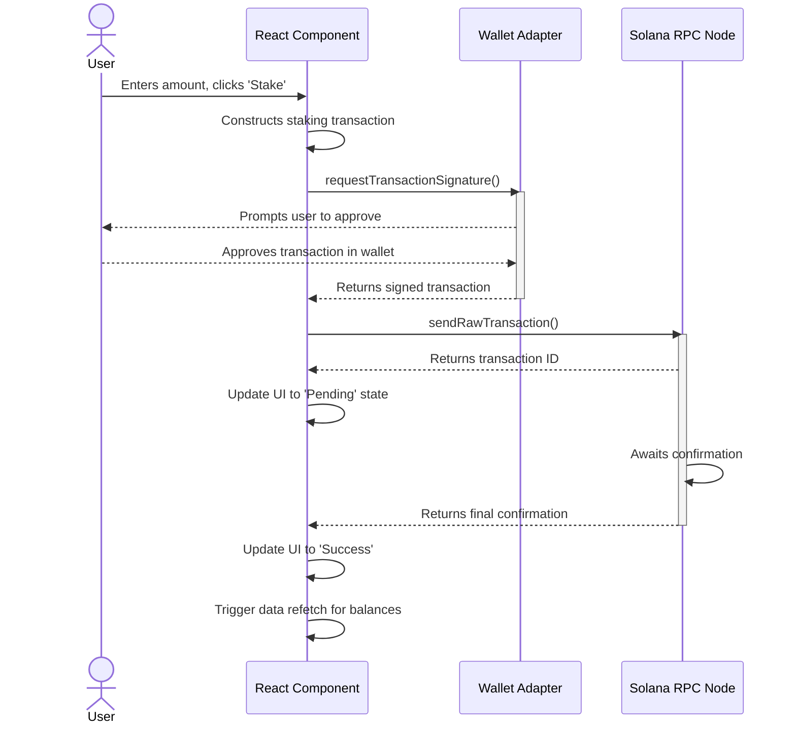

# Section 8: Core Workflows

## Staking Transaction Flow

```mermaid
sequenceDiagram
    actor User
    participant StakingModule as React Component
    participant WalletAdapter as Wallet Adapter
    participant SolanaRPC as Solana RPC Node

    User->>StakingModule: Enters amount, clicks 'Stake'
    StakingModule->>StakingModule: Constructs staking transaction
    StakingModule->>WalletAdapter: requestTransactionSignature()
    activate WalletAdapter
    WalletAdapter-->>User: Prompts user to approve
    User-->>WalletAdapter: Approves transaction in wallet
    WalletAdapter-->>StakingModule: Returns signed transaction
    deactivate WalletAdapter
    
    StakingModule->>SolanaRPC: sendRawTransaction()
    activate SolanaRPC
    SolanaRPC-->>StakingModule: Returns transaction ID
    StakingModule->>StakingModule: Update UI to 'Pending' state
    
    SolanaRPC->>SolanaRPC: Awaits confirmation
    SolanaRPC-->>StakingModule: Returns final confirmation
    deactivate SolanaRPC
    
    StakingModule->>StakingModule: Update UI to 'Success'
    StakingModule->>StakingModule: Trigger data refetch for balances
```
